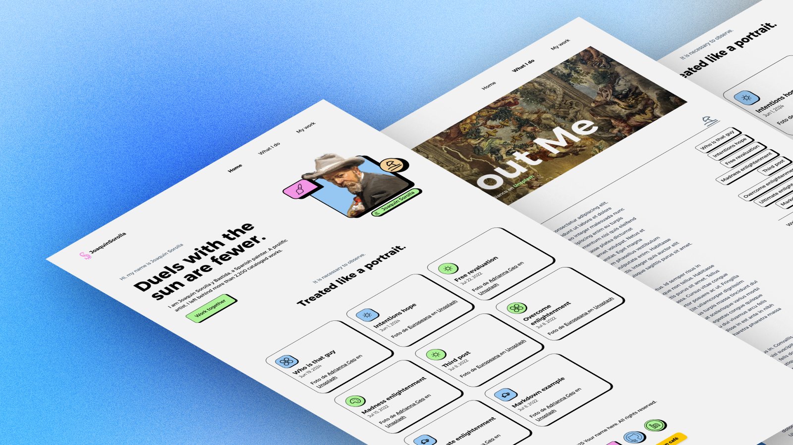

# Sorolla Portfolio



Welcome to my personal portfolio demo repository! This project is a demonstration of what a personal portfolio could look like. It showcases various aspects of web development, including my work, skills, and projects.

- You can view the deployed project at the following URL: [https://sorolla.netlify.app/](https://sorolla.netlify.app/)
- Astro web templates: https://astro.build/themes/details/sorollaportfolio/

## 📂 Project Structure

- **public/**: Contains public assets like images and fonts.
- **src/**: Includes the source code for the portfolio.
- **.gitignore**: Specifies files and directories to be ignored by Git.
- **astro.config.mjs**: Configuration file for Astro.
- **package.json**: Lists project dependencies and scripts.
- **tailwind.config.mjs**: Configuration file for Tailwind CSS.
- **tsconfig.json**: TypeScript configuration file.


### 🧭 /src structure

The `/src` directory contains the main source code for the project. Below is an overview of its structure:

```
src
├── assets
│   ├── adriana.webp
│   ├── euro.webp
│   ├── fran.webp
│   └── hero.webp
├── components
│   ├── BaseHead.astro
│   ├── Footer.astro
│   ├── FormattedDate.astro
│   ├── Header.astro
│   ├── HeaderLink.astro
│   ├── Hero.astro
│   └── WhatIDo.astro
├── consts.ts
├── content
│   └── blog
│       └── content in markdown format
├── content.config.ts
├── icons
│   ├── 1.svg
│   ├── 2.svg
│   ├── 3.svg
│   ├── 4.svg
│   ├── 5.svg
│   ├── beach.svg
│   ├── github.svg
│   ├── linkedin.svg
│   ├── paint.svg
│   └── web.svg
├── layouts
│   └── BlogPost.astro
├── pages
│   ├── about.astro
│   ├── blog
│   │   ├── index.astro
│   │   └── [...slug].astro
│   ├── index.astro
│   └── rss.xml.js
└── styles
    ├── global.css
    └── hamburgers.css
```

#### Explanation

- **assets**: Contains image files used in the project.
- **components**: Contains reusable UI components built with Astro.
- **content**: Contains blog content in Markdown format.
- **content.config.ts**: Configuration file for content collections.
- **icons**: Contains SVG icon files used in the project.
- **layouts**: Contains layout components.
  - `BlogPost.astro`: Layout component for blog posts.
- **pages**: Contains the main pages of the site.
  - `blog/index.astro`: Blog index page.
  - `blog/[...slug].astro`: Dynamic route for individual blog posts.
- **styles**: Contains global and component-specific CSS files.
  - `global.css`: Global styles for the project.
  - `hamburgers.css`: Styles for the hamburger menu.

This structure helps in organizing the project files and makes it easier to maintain and scale the project.


## 🚀 Getting Started

To run this project locally:

1. **Clone the repository:**

   ```bash
   git clone https://github.com/jramma/sorollaportfolio.git
   cd sorollaportfolio
   ```

2. **Install dependencies:**

   ```bash
   bun install
   ```

3. **Start the development server:**

   ```bash
   bun dev
   ```

   The application will be available at `http://localhost:4321`.

## 🛠️ Technologies Used

- **Astro**: A modern static site builder.
- **Tailwind CSS**: A utility-first CSS framework.
- **TypeScript**: A statically typed programming language.

## 📄 License

This project is licensed under the [MIT License](LICENSE).
